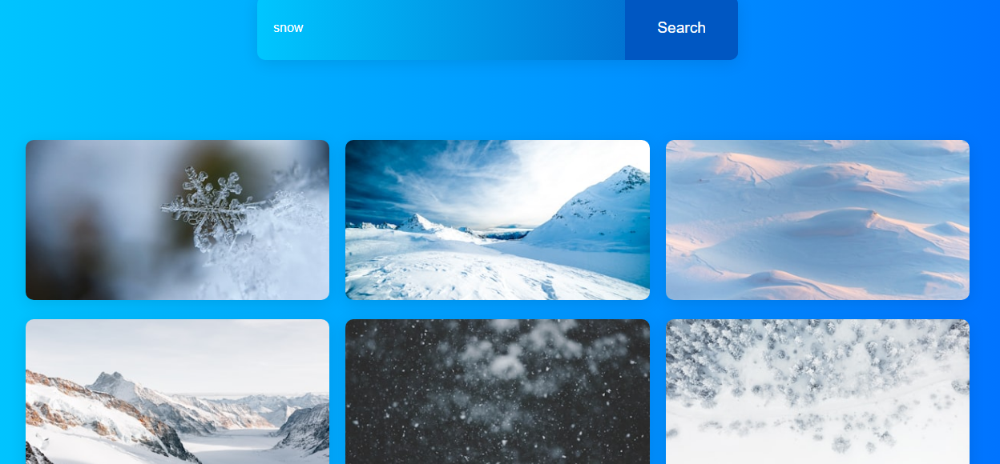
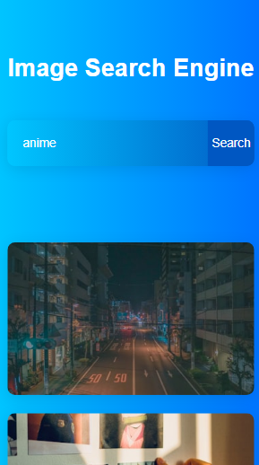

# 🌄 Image Search Engine

A simple and responsive Image Search Engine built using **HTML**, **CSS**, and **JavaScript**, powered by the **Unsplash API**. This web app allows users to search for beautiful, high-quality images from Unsplash and displays them in a gallery format.

## 🚀 Features

- 🔍 Search for any type of image using keywords
- 🖼️ Dynamically loads images from Unsplash
- 📎 Click on any image to view it on Unsplash in a new tab
- 💡 Responsive and user-friendly design
- Infinite scroll or "Load More" button

## 📷 Demo




## 🛠️ Technologies Used

- HTML5
- CSS3
- JavaScript (ES6)
- [Unsplash API](https://unsplash.com/documentation)

## 🧠 How It Works

1. User enters a search term in the input box
2. JavaScript fetches image results from the Unsplash API using `fetch()`
3. The images are displayed in a grid with clickable links
4. Clicking an image opens the original on Unsplash in a new tab

## 🔑 Getting Started

### Prerequisites
- A web browser (Chrome, Firefox, etc.)
- Internet connection
- Unsplash API Access Key (Free at [unsplash.com/developers](https://unsplash.com/developers))

### Setup Instructions

1. Clone or download this repository
2. Replace `"ACCESS_KEY"` in `script.js` with your actual Unsplash API key:

   ```js
   const accessKey = "ACCESS_KEY";
   ```

3. Open `index.html` in your browser and start searching!

## 📁 Project Structure

```
image-search-engine/
├── index.html
├── style.css
├── script.js
└── README.md
```

## 📌 Future Improvements
- Light/Dark mode toggle
- Search history feature
- Loader/spinner during API call

## 🙌 Credits

- Images provided by [Unsplash](https://unsplash.com)
- Inspired by beginner-friendly JavaScript projects

## 📄 License

This project is licensed under the MIT License. Feel free to use, modify, and share it!
